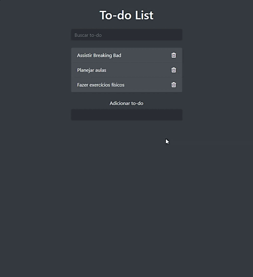

<h1 align="center">Todo List CJRM</h1>

<h4 align="center"> 
	🚧  Todo List CJRM 🚀 Under construction...  🚧
</h4> 

<h1 align="center">
	
</h1>

## :dart: Sobre ##

To-do list desenvolvido no curso CJRM do professor Roger Melo

## :sparkles: Funções ##

:heavy_check_mark: Inserir tarefas;
:heavy_check_mark: Deletar tarefas;
:heavy_check_mark: Buscar tarefas;

### Minhas modificações

:heavy_check_mark: Checagem de lista(riscar tarefa antes de deletar;

:x: Implementar um drag and drop;

## :rocket: Tecnologias ##

Neste projeto foram utilizadas as seguintes ferramentas:

- [Bootstrap](https://getbootstrap.com/)
- Jasvascript
